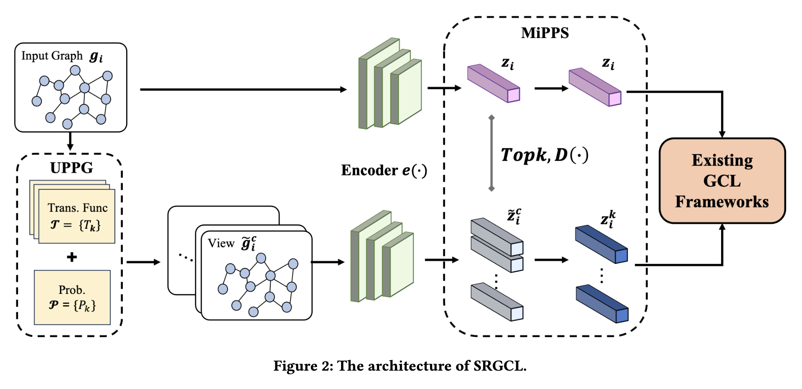

# SRGCL: Self-Reinforcement Graph Contrastive Learning

nameA, nameB, nameC, nameD, nameE

## Paper



Please check our arXiv version [here](https://) for the full paper with supplementary.

## Requirement

```shell
python 3.9.16
torch 2.4.1
torchvision 0.19.1
```

## Project Directory Structure

- `autogcl/`
- `data/` - Directory for storing datasets
- `graphcl/`
- `.gitignore`
- `README.md`

Note: Place your data in the current directory.

## GraphCL

### Run
Please check the README in graphcl/ for more details.

```shell
cd graphcl
CUDA_VISIBLE_DEVICES=0 python gcl_gcl_method6_temperature.py --DS='MUTAG' --aug='dnodes'
```

## AutoGCL

### Run
Please check the README in autogcl/ for more details.

```shell
cd autogcl/unsupervised
CUDA_VISIBLE_DEVICES=0 python us_main_temperature_hybrid2.py --dataset='MUTAG'
```


## Citation

If you find this work helpful, please kindly cite our [paper](https://).

```latex
@article{2025srgcl,
  title={SRGCL: Self-Reinforcement Graph Contrastive Learning},
  author={},
  journal={arXiv preprint arXiv:},
  year={2025}
}
```
